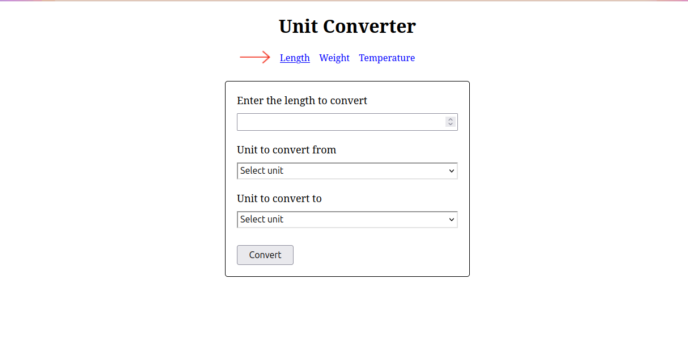
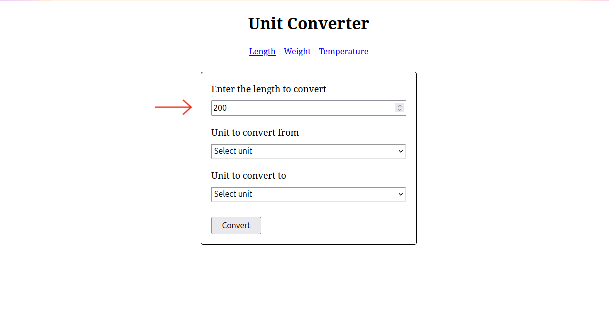
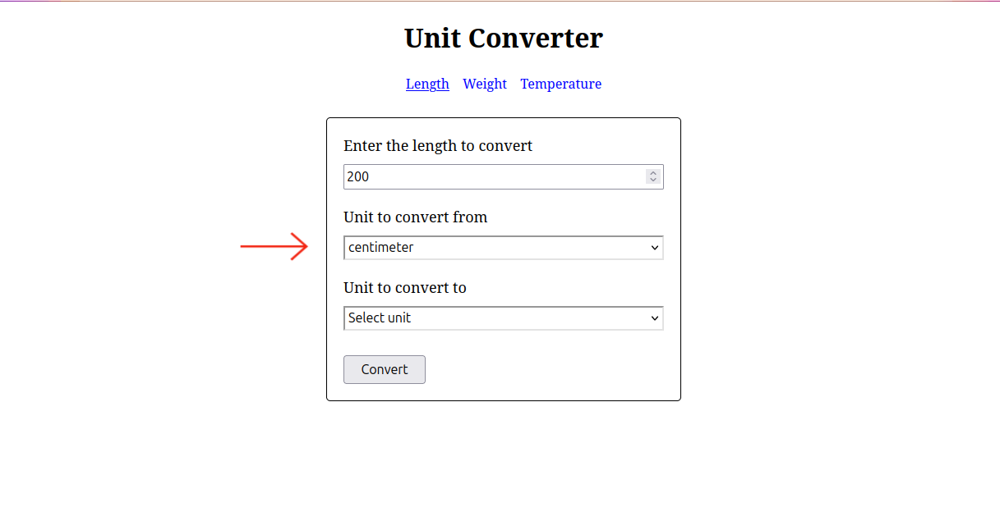
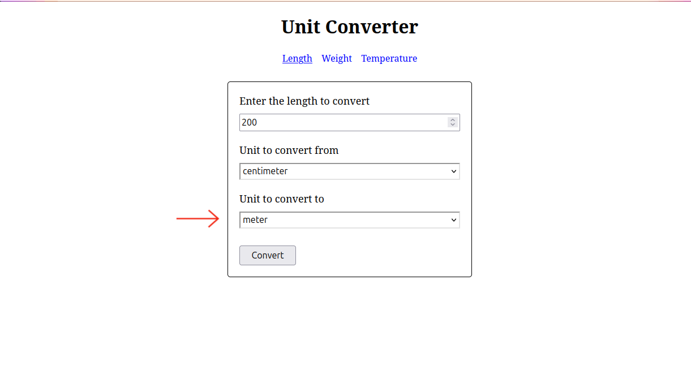
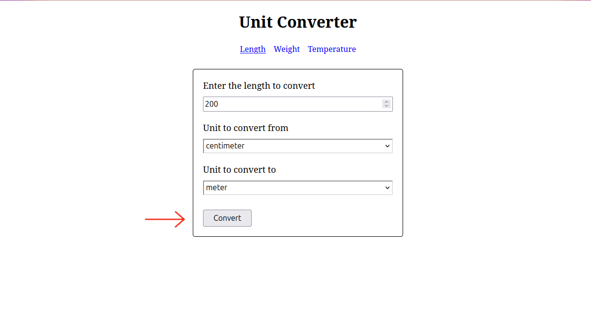
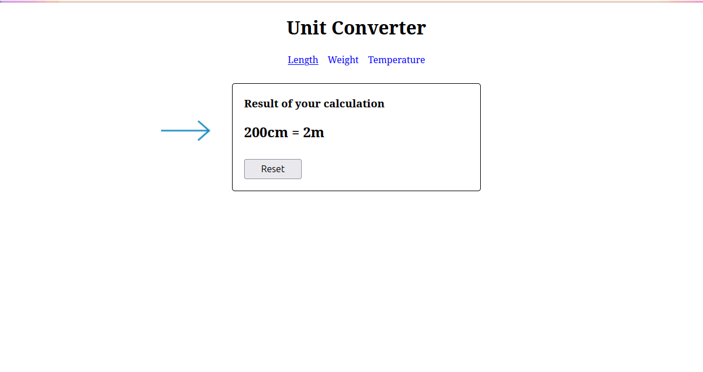

# Java Unit Converter

> Simple unit converter web app built with HTML and Java.

## Table of Contents

* [General Info](#general-information)
* [Technologies Used](#technologies-used)
* [Features](#features)
* [Setup](#setup)
* [Usage](#usage)
* [Project Status](#project-status)
* [Acknowledgements](#acknowledgements)
* [License](#license)

## General Information

Java Unit Converter is a simple web application that can convert between different units of measurement. It can convert units of length, weight, volume, area, temperature, and more. The user can input a value and select the units to convert from and to. The application will then display the converted value. This project is designed to explore and practice logic building and working with the HTML and server in Java.

## Technologies Used

* HTML
* CSS
* Java 21.0.6 LTS
* Maven 3.9.9
* Jakarta Servlet 6.1.0

## Features

This app can convert between different units of measurement for length, weight, and temperature. Supported conversions include:

* **Length**:
    * millimeter (mm)
    * centimeter (cm)
    * meter (m)
    * kilometer (km)
    * inch (in)
    * foot (ft)
    * yard (yd)
    * mile (mi)

* **Weight**:
    * milligram (mg)
    * gram (g)
    * kilogram (kg)
    * ounce (oz)
    * pound (lb)

* **Temperature**:
    * Celsius (°C)
    * Fahrenheit (°F)
    * Kelvin (K)

## Setup

To run this web app, you’ll need:

* **Java**: Version 21 or higher
* **Maven**: Version 3.x
* **Apache Tomcat**: Version 11.0.0-M20

How to install:

1. Clone the repository

   ```bash
   git clone https://github.com/krisnaajiep/java-unit-converter.git
   ```

2. Change the current working directory

   ```bash
   cd java-unit-converter
   ```

3. Build the project

   ```bash
   mvn clean package
   ```

4. Copy the WAR file from the target/ directory to the webapps folder in your Apache Tomcat directory

   ```bash
   cp target/java-unit-converter-1.0-SNAPSHOT.war path/to/tomcat/webapps/unit-converter.war 
   ```

5. Run the Apache Tomcat and access the URL
    
   ```bash
   http://localhost:8080/unit-converter
   ```

## Usage

1. Select one of the units of measurement in the navigation menu.

   

2. Input a value to convert.

   

3. Select the units to convert from.

   

4. Select the units to convert to.

   

5. Select the `Convert` button.

   

6. View the converted value.

   

## Project Status

Project is: _complete_.

## Acknowledgements

This project was inspired by [roadmap.sh](https://roadmap.sh/projects/unit-converter).

## License

This project is licensed under the MIT License—see the [LICENSE](./LICENSE) file for details.